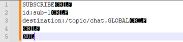
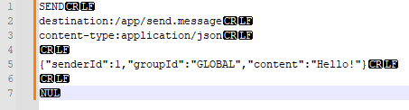

## README

This is template/example repository for BE project for Sourcery Academy's 2025 Spring session.
It is possible to run linting(Spotless, SpotBugs, PMD) on demand with command ./gradlew check

<h1> How to Run a Project </h1>

**Database Credentials**  
DB Credentials: username: `db_user`, password: `password` (in application.yml)  

**Docker**  
Start required services for the project with: `docker compose -p edvinas-be up -d` 

**Firebase**  
Link to the Firebase project: https://console.firebase.google.com/project/sourcery-academy/settings/serviceaccounts/adminsdk
1. To get JSON file go under `Service Accounts` -> `Generate new private key`.
2. Rename the downloaded file to `firebase.json`
3. That downloaded JSON file should be placed in `src/main/resources/firebase/firebase.json` folder.

**Run locally**  
Run Local with: `./gradlew bootRun --args="--spring.profiles.active=local"`  
Run Prod with `./gradlew bootRun --args="--spring.profiles.active=prod"`

<h1>API docs</h1>

**Local**:  
Swagger UI: http://localhost:8080/swagger-ui/index.html  
OpenAPI JSON: http://localhost:8080/v3/api-docs  

**Deployed**:  
Swagger UI: https://aurora-chat.api.devbstaging.com/swagger-ui/index.html  
OpenAPI JSON: https://aurora-chat.api.devbstaging.com/v3/api-docs  

h1>To test out websockets in FE:</h1>

There is no user, group creation currently you to test out the capabilities
you will need to add db entries manually.

1. Login into the app.
2. Go to App.tsx

   useEffect(() => {
   const auth = getAuth();
   const user = auth.currentUser;
   if (user) {

3. Add console.log(user.uid);

   setUserId(user.uid);
   } else {
   console.warn('No authenticated user');
   }
   }, []);

4. Copy the value from console log (it is your id)
5. Creat user with that id
6. Repeat steps 1, 4, 5 with a different email account 
7. Create a db entry into group table
8. Create a db entries into user_groups table
Then you go the url the group you created should be displayed
then you click on it a chat with the other account should be open
if you open two different browsers with different users you can chat 
between them

<h1>To test out websockets in POSTMAN:</h1>
Use Notepad++:

1. Enable View → Show Symbol → Show All Characters
2. Write the first STOMP frame:

<h3>FIRST STOMP FRAME</h3>
CONNECT
accept-version:1.1,1.2
heart-beat:0,0

^@

3. Leave the empty line between the text and ^@ and replace ^@ with a NULL character using Edit → Character Panel → NULL (0)
- 
4. Select all → Plugins → MIME Tools → Base64 Encode with Padding and copy the encoded result.
5. Open POSTMAN and inside select the "Websocket" option, connect to ws://localhost:8080/ws-stomp
6. Change the message type from "Text", to "Binary" and "Base64"
7. Paste the text and send, you should see a blue received message such as CONNECTED
8. Repeat steps 2-7 with the SECOND and THIRD STOMP frames below:

<h3>SECOND STOMP FRAME</h3>
SUBSCRIBE
id:sub-1
destination:/topic/chat.GLOBAL

^@

<h3>THIRD STOMP FRAME</h3>
SEND
destination:/app/send.message
content-type:application/json

{"senderId":1,"groupId":"GLOBAL","content":"Hello!"}

^@

##### Testing websockets with POSTMAN links:
https://dev.to/danielsc/testing-stomp-websocket-with-postman-218a
https://stackoverflow.com/questions/71696431/how-to-test-stomp-application-using-postman
https://stomp.github.io/stomp-specification-1.2.html#STOMP_Frames